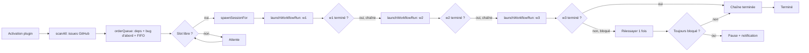

# openfox-automate

> 🇬🇧 [English version →](README.md)

Traitement autonome des issues GitHub pour [OpenFox](https://github.com/co-l/openfox).
Le plugin scanne les issues ouvertes des dépôts que vous surveillez, les classe de
manière intelligente (dépendances parent/enfant, bug vs. feature, FIFO), ouvre une
session OpenFox par issue, et exécute une chaîne de workflows configurable de bout
en bout (`Plan Issue v2` → `Build & Verify Auto v2` → `Delivery v2` par défaut).

| Licence | OpenFox peer | Statut |
|---------|--------------|--------|
| MIT     | `>=2.0.140`  | v0.1.0 (squelette) |

## Pourquoi l’utiliser

- **Fini le copier-coller d’URL d’issue dans OpenFox** — choisissez les dépôts,
  étiquetez vos issues, le plugin s’occupe du reste.
- **Autonomie de bout en bout** — chaque session exécute une chaîne de workflows
  pour planifier, construire, vérifier et livrer sans intervention manuelle.
- **Gardez le contrôle** — pause, reprise, retraitement et inspection de chaque
  session depuis le panneau Issue Queue.
- **Zéro dépendance runtime** — `fetch` natif, pas de SDK.

## Comment ça marche



## Pré-requis

- OpenFox `>=2.0.140` (API plugin v2 et runner de workflows)
- Node.js `>=24` (pour `fetch` natif)
- Un Personal Access Token GitHub avec les portées :
  - `repo` (lecture/écriture issues et PR sur les dépôts cibles)
  - `read:org` (si les dépôts sont dans une organisation)
- Trois workflows OpenFox disponibles par identifiant (défauts) :
  - `Plan Issue v2`
  - `Build & Verify Auto v2`
  - `Delivery v2`
- Un projet OpenFox par dépôt cible (le mapping relie dépôts et projets).

## Installation

1. Ouvrez OpenFox et allez dans **Settings → Plugins**.
2. Cliquez sur **Install from GitHub URL** et saisissez
   `https://github.com/theshwal/openfox-automate`.
3. Cliquez sur **Enable**.
4. Un nouveau bouton **Issue Queue** apparaît dans l’en-tête.
5. Ouvrez le panneau, remplissez le formulaire **Settings** (jeton + mappage des
   dépôts) et le plugin est prêt.

## Configuration

### Requis

| Clé | Rôle |
|-----|------|
| `github.token` | Votre PAT à granularité fine. |
| `repos.mapping` | Une ligne `owner/repo=projectId` par dépôt. |

### Optionnel (défauts fournis)

| Clé | Défaut | Rôle |
|-----|--------|------|
| `workflows.chain` | `Plan Issue v2` / `Build & Verify Auto v2` / `Delivery v2` | Identifiants de workflows exécutés séquentiellement par session. |
| `workflows.repoOverrides` | vide | `owner/repo=w1,w2,w3` surcharge la chaîne pour un dépôt. |
| `scan.refreshMinutes` | `30` | Intervalle d’auto-scan. |
| `scan.startupScan` | `true` | Scanner immédiatement à l’activation. |
| `scan.ignoreLabels` | `wontfix,duplicate,needs-discussion` | Issues avec un de ces labels ignorées. |
| `batch.maxConcurrency` | `3` | Plafond global de sessions simultanées. |
| `batch.maxConcurrencyPerRepo` | `2` | Plafond par dépôt (combiné via `min(global, perRepo)`). |
| `ordering.strategy` | `default` | `default` \| `priority-labels` \| `strict-deps`. |
| `ordering.dependencyPattern` | regex | Détecte `#N`, `depends on #N`, `blocked by #N` dans le corps des issues. |
| `dryRun` | `false` | Si vrai : scan et tri mais aucune session, aucune écriture GitHub. |
| `history.retentionCount` | `100` | Nombre max d’entrées terminées gardées dans l’historique. |
| `post.closeOnSuccess` | `false` | Fermer l’issue à la fin de la chaîne. |
| `post.assignOnSuccess` | `false` | M’assigner l’issue à la fin de la chaîne. |
| `post.commentTemplate` | vide | Modèle de commentaire optionnel (Delivery v2 gère par défaut). |
| `post.reprocessResetsRetryCount` | `true` | Le retraitement remet le compteur à zéro. |
| `pr.monitorEnabled` | `true` | Surveiller les PR ouvertes (conflits / fusions). |
| `pr.urlRegex` | regex PR GitHub | Regex pour capturer les URL de PR dans la sortie de l’agent. |

### Exemple `repos.mapping`

```
# Format : owner/repo=id-projet-openfox
theshwal/visipdp = proj-visipdp-abc123
theshwal/api-server = proj-api-def456
mon-org/private-tool = proj-private-ghi789
```

### Exemple `workflows.repoOverrides`

```
# Format : owner/repo=id-workflow1,id-workflow2,id-workflow3
theshwal/api-server = Plan Issue v2,Hotfix Auto v2,Delivery v2
```

## Utilisation

Après installation + configuration, le plugin :

1. Scanne chaque dépôt mappé pour les issues ouvertes à l’activation (et toutes
   les `refreshMinutes`).
2. Détecte les dépendances entre issues et les trie
   (`default` : sans bloqueurs → bug > feature > docs → FIFO).
3. Ouvre une session OpenFox par issue en tête de file, en respectant
   `maxConcurrency` (global et par dépôt).
4. Exécute la chaîne de workflows configurée sur la session.
5. Marque l’entrée de file `done` une fois la chaîne terminée avec succès.
6. Capture l’URL de PR ouverte et la surveille (conflits, fusions).

Ouvrez le panneau **Issue Queue** pour :

- Inspecter les onglets File active, Historique, Métriques.
- Filtrer la file par texte libre ou statut.
- Déclencher un scan, mettre en pause, annuler une session en cours, retraiter
  une entrée en échec.
- Lancer un contrôle de santé (jeton + dépôts + workflows + projets + mappage).

## Capabilities

| Capability | Utilisation |
|------------|------------|
| `tools` | `issue_queue_list`, `issue_queue_status` |
| `settings` | Formulaire de settings auto-rendu |
| `ui` | `issue-queue-panel`, action header |
| `rpc` | `scan_now`, `start_issue`, `cancel_issue`, `reprocess`, `health`, `getQueue`, `getHistory`, `getMetrics`, `ping` |
| `hooks` | `workflow.execution.changed`, `task.completed`, `session.created`, `tool.completed` |
| `notifications` | Toasts : entrée ajoutée, chaîne terminée, retry, erreurs |

## Permissions

Le plugin s’exécute dans le même process qu’OpenFox et importe dynamiquement les
internes serveur (`sessionManager`, `launchWorkflowRun`) pour piloter la création
de session et le chaînage de workflows. Aucun mot de passe n’est requis.

L’accès GitHub utilise le PAT stocké dans `github.token`. Par défaut, le plugin
ne fait **aucune écriture** sur GitHub — l’interaction (commentaire, label, PR,
fermeture) est déléguée au workflow `Delivery v2`. Activez les toggles `post.*`
pour surcharger.

## Dépannage

| Symptôme | Cause probable / correctif |
|----------|----------------------------|
| **Le plugin n’apparaît pas dans l’onglet Plugins** | Vérifiez que l’URL `https://github.com/theshwal/openfox-automate` est accessible et qu’OpenFox a accès au réseau. |
| **`openFoxInternals: missing` au health check** | Le chemin d’installation d’OpenFox n’a pas pu être résolu. Réinstallez OpenFox ou vérifiez `import.meta.resolve('openfox')`. |
| **`workflows: not-found` au health check** | Un identifiant de `workflows.chain` n’existe pas. Vérifiez dans l’onglet **Workflows** d’OpenFox. |
| **`mapping: invalid` au health check** | Une ligne de `repos.mapping` est mal formée. Le panneau de health check affiche les numéros de ligne. |
| **La file grandit mais rien ne se lance** | Tous les slots sont occupés. Augmentez `batch.maxConcurrency` ou attendez la fin des chaînes en cours. |
| **Notifications « bloqué » répétées** | Un workflow n’atteint pas `$done`. Ouvrez la session, intervenez manuellement, cliquez sur **Re-process**. |
| **Avertissement rate-limit à chaque scan** | Réduisez la fréquence de scan (`scan.refreshMinutes`) ou utilisez un jeton avec des limites plus élevées. |

## Développement

```bash
# Installation des dépendances (les peer deps viennent de votre install OpenFox)
npm install

# Vérification de types
npm run typecheck

# Tests unitaires
npm test

# Tests e2e (fetch GitHub mocké)
npm run test:e2e

# Build de la sortie compilée (dist/) utilisée par le host plugin
npm run build
```

## Limitations / Problèmes connus

- Le plugin importe dynamiquement `sessionManager` et `launchWorkflowRun` depuis
  le chemin d’installation d’OpenFox. Si OpenFox renomme ces modules, le plugin
  affichera un diagnostic à l’activation jusqu’à mise à jour du résolveur.
- La pagination au-delà de 100 issues par dépôt et par scan est implémentée via
  une boucle de pages ; les grands dépôts peuvent prendre plus longtemps à scanner.
- Le scan piloté par webhook est prévu pour la v2 (polling uniquement en v1).

## Licence

MIT.
