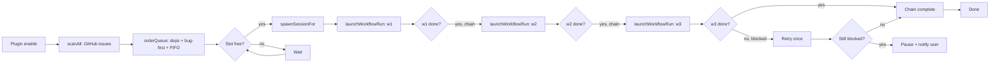

# openfox-automate

> 🇫🇷 [Version française →](README.fr.md)

Autonomous GitHub issue processing for [OpenFox](https://github.com/co-l/openfox). Scan
open issues on the repositories you care about, order them intelligently (parent/child
dependencies, bug vs. feature, FIFO), open one OpenFox session per issue, and run a
configurable chain of workflows end-to-end (`Plan Issue v2` → `Build & Verify Auto v2`
→ `Delivery v2` by default).

| License | OpenFox peer | Status |
|---------|--------------|--------|
| MIT     | `>=2.0.140`  | v0.1.0 (skeleton) |

## Why use it

- **Stop copy-pasting issue URLs into OpenFox** — pick the repositories, label your
  issues, and the plugin takes care of the rest.
- **End-to-end autonomy** — sessions run a chain of workflows so each issue is
  planned, built, verified, and delivered without manual handoff.
- **Stay in control** — pause, resume, re-process, and inspect every session from the
  Issue Queue panel.
- **Zero runtime dependencies** — native `fetch`, no SDKs.

## How it works



## Plugin architecture

The plugin runs **in-process** with the OpenFox host. It uses the host-exposed
`PluginContext.openFoxInternals` (apiVersion 2, added in OpenFox
`>= 2.0.160`) to drive sessions and workflow chains — no HTTP, no password,
no dynamic import of host internals.

```ts
// What the plugin calls (when the host exposes internals):
const session = await context.openFoxInternals.sessionManager.createSession(
  projectId,
  `[issue #${issueNumber}] ${title}`,
)
// session.id → stored in entry.sessionId, used by subsequent runWorkflow calls

context.openFoxInternals.runWorkflow(sessionId, {
  workflowId: 'Plan Issue v2',
  params: { issue_url, issue_title, repo_key, ... },
  content: buildIssueContext(entry), // markdown rendered to the agent
})
```

### Fallback for older hosts

Hosts without `openFoxInternals` (OpenFox `< 2.0.160`) trigger a fallback path
that resolves `openfox` via `import.meta.resolve(...)` and dynamically imports
`sessionManager` + `launchWorkflowRun`. The plugin's `health()` RPC reports
which path is active.

### Host-side verification

```bash
# Plugin loaded with the openFoxInternals path:
curl -X POST http://localhost:10369/api/plugins/openfox-automate/rpc/health
# → { "openFoxInternals": { "sessionManager": "ok", "launchWorkflowRun": "ok" }, ... }
```

## Requirements

- OpenFox `>=2.0.140` (must expose the plugin v2 API and the workflow runner)
- Node.js `>=24` (for native `fetch`)
- A GitHub Personal Access Token with scopes:
  - `repo` (read/write issues and pull requests on the target repositories)
  - `read:org` (if the repositories live in an organisation)
- Three OpenFox workflows available by id (defaults):
  - `Plan Issue v2`
  - `Build & Verify Auto v2`
  - `Delivery v2`
- One OpenFox project per target repository (the mapping ties repos to projects).

## Installation

1. Open OpenFox and go to **Settings → Plugins**.
2. Click **Install from GitHub URL** and enter
   `https://github.com/theshwal/openfox-automate`.
3. Click **Enable**.
4. A new header button **Issue Queue** appears.
5. Open the panel, fill in the **Settings** form (token + repo mapping), and you're
   ready.

## Configuration

### Required

| Key | Purpose |
|-----|---------|
| `github.token` | Your fine-grained PAT. |
| `repos.mapping` | One `owner/repo=projectId` per line. |

### Optional (defaults provided)

| Key | Default | Purpose |
|-----|---------|---------|
| `workflows.chain` | `Plan Issue v2` / `Build & Verify Auto v2` / `Delivery v2` | Ordered workflow IDs run sequentially per session. |
| `workflows.repoOverrides` | empty | `owner/repo=w1,w2,w3` overrides the chain for one repo. |
| `scan.refreshMinutes` | `30` | Auto-scan interval. |
| `scan.startupScan` | `true` | Scan immediately on plugin enable. |
| `scan.ignoreLabels` | `wontfix,duplicate,needs-discussion` | Issues with any of these labels are skipped. |
| `batch.maxConcurrency` | `3` | Global ceiling on simultaneous sessions. |
| `batch.maxConcurrencyPerRepo` | `2` | Per-repo ceiling (combined with global via `min(global, perRepo)`). |
| `ordering.strategy` | `default` | `default` \| `priority-labels` \| `strict-deps`. |
| `ordering.dependencyPattern` | regex | Detects `#N`, `depends on #N`, `blocked by #N` in issue bodies. |
| `dryRun` | `false` | When true, scan and order run but no session is created, no GitHub write happens. |
| `history.retentionCount` | `100` | Max terminated entries kept in history. |
| `post.closeOnSuccess` | `false` | Close the issue on chain completion. |
| `post.assignOnSuccess` | `false` | Assign the issue to you on completion. |
| `post.commentTemplate` | empty | Optional comment template (Delivery v2 handles comments by default). |
| `post.reprocessResetsRetryCount` | `true` | Re-process resets the retry counter. |
| `pr.monitorEnabled` | `true` | Poll opened PRs for conflicts / merges. |
| `pr.urlRegex` | GitHub PR URL regex | Pattern used to capture PR URLs from agent output. |

### Example `repos.mapping`

```
# Format: owner/repo=openfox-project-id
theshwal/visipdp = proj-visipdp-abc123
theshwal/api-server = proj-api-def456
mon-org/private-tool = proj-private-ghi789
```

### Example `workflows.repoOverrides`

```
# Format: owner/repo=workflowId1,workflowId2,workflowId3
theshwal/api-server = Plan Issue v2,Hotfix Auto v2,Delivery v2
```

## Usage

After install + configuration, the plugin:

1. Scans every mapped repository for open issues on enable (and every `refreshMinutes`).
2. Detects dependencies between issues and orders them
   (`default`: no blockers → bug > feature > docs → FIFO).
3. Opens one OpenFox session per top-of-queue issue, respecting `maxConcurrency`
   (global and per repo).
4. Runs the configured workflow chain on the session.
5. Marks the queue entry `done` once the chain completes successfully.
6. Captures any opened PR URL and monitors it for conflicts and merges.

Open the **Issue Queue** panel to:

- Inspect the active queue, history, and metrics tabs.
- Filter the queue by free-text or status.
- Trigger a scan, pause auto-scan, cancel a running session, re-process a failed entry.
- Run a health check (token + repos + workflows + projects + mapping).

## Capabilities

| Capability | Used for |
|------------|----------|
| `tools` | `issue_queue_list`, `issue_queue_status` |
| `settings` | Auto-rendered settings form |
| `ui` | `issue-queue-panel`, header action |
| `rpc` | `automate.scanNow`, `automate.startIssue`, `automate.cancelIssue`, `automate.reprocess`, `automate.health`, `automate.getQueue`, `automate.getHistory`, `automate.getMetrics`, `automate.ping` |
| `hooks` | `workflow.execution.changed`, `task.completed`, `session.created`, `tool.completed` |
| `notifications` | Toasts on entry added, chain done, retries, errors |

## Permissions

The plugin runs in-process with the rest of OpenFox and uses dynamic imports of
OpenFox server internals (`sessionManager`, `launchWorkflowRun`) to drive session
creation and workflow chaining. No password is required.

GitHub access uses the PAT stored in `github.token`. By default the plugin makes
**no write calls** to GitHub — interaction (comment, label, PR, close) is delegated
to the `Delivery v2` workflow. Toggle the `post.*` settings to override.

## Troubleshooting

| Symptom | Likely cause / fix |
|---------|--------------------|
| **Plugin does not appear in the Plugins tab** | Check the URL `https://github.com/theshwal/openfox-automate` resolves and that OpenFox has network access. |
| **Health check shows `openFoxInternals: missing`** | OpenFox install path could not be resolved. Reinstall OpenFox or check `import.meta.resolve('openfox')` in devtools. |
| **Health check shows `workflows: not-found`** | One or more workflow IDs in `workflows.chain` are not installed. Verify in OpenFox **Workflows** tab. |
| **Health check shows `mapping: invalid`** | A `repos.mapping` line is malformed. Run the panel health check to see line numbers. |
| **Queue grows but nothing spawns** | All slots are busy. Increase `batch.maxConcurrency` or wait for current chains to finish. |
| **Repeated "blocked" notifications** | The workflow cannot reach `$done`. Open the session, intervene manually, then click **Re-process**. |
| **Rate limit warning on every scan** | Decrease scan frequency (`scan.refreshMinutes`) or use a token with higher rate limits. |

## Development

```bash
# Install deps (peer deps come from your OpenFox install)
npm install

# Type-check
npm run typecheck

# Run unit tests
npm test

# Run e2e (GitHub fetch is mocked)
npm run test:e2e

# Build the compiled output (dist/) used by the plugin host
npm run build
```

## Limitations / Known issues

- The plugin dynamically imports `sessionManager` and `launchWorkflowRun` from the
  host OpenFox install path. If OpenFox renames those modules, the plugin will
  surface a diagnostic on enable until the resolver is updated.
- Pagination beyond 100 issues per repository per scan is implemented via a
  follow-up page loop; large repositories may take longer to scan.
- Webhook-driven scans are planned for v2 (polling only in v1).

## License

MIT.
